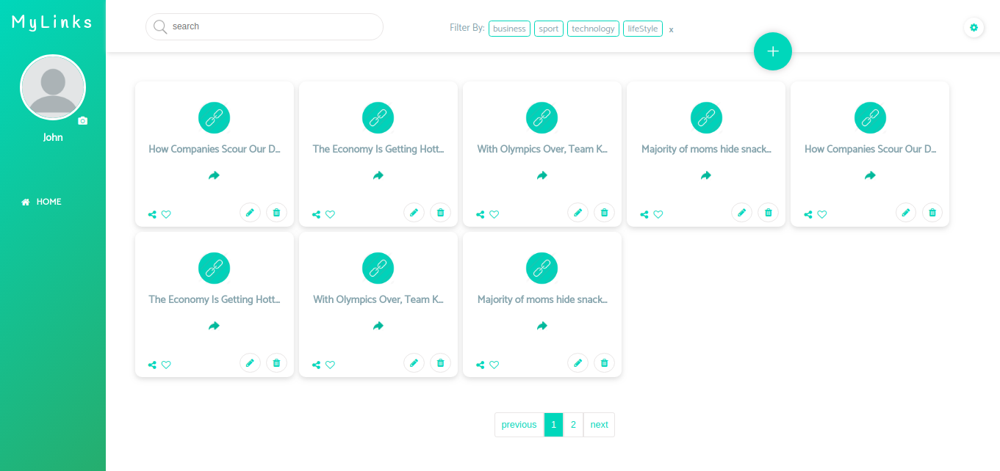

[](https://travis-ci.org/Jessica7/mylinks)

# Link.me



## About project

The idea of ​​this site is:

_"Save as many links as you want! So simple, easy and organized"_

**Link.me** is the site link manager where you can save as many links as you like. You can organize your way, create categories and more.

## Why?

This project is part of my personal portfolio, so, I'll be happy if you could provide me any feedback about the project, code, structure or anything that you can report that could make me a better developer!

Email-me: jessica.nascimento6@gmail.com

Also, you can use this Project as you wish, be for study, be for make improvements or more!

## Getting Started

### Prerequisites

To run this project in the development mode, you'll need to have a basic environment to run a React Native, that can be found [here](https://create-react-app.dev/docs/getting-started/).


### Installing

**Cloning the Repository**

```
$ git clone git@github.com:Jessica7/mylinks.git

$ cd mylinks
```

**Installing dependencies**

```
$ yarn
```

_or_

```
$ npm install
```

### Running

With all dependencies installed and the environment properly configured, you can now run the app:

Android

```
$ npm start
```

## Built With

- [React](https://pt-br.reactjs.org/) - Open source JavaScript library focusing on creating user interfaces on web page
- [Webpack](https://webpack.js.org/) - Webpack is an open source JavaScript module wrapper.
- [Redux](https://redux.js.org/) - React State Manager
- [ES6](https://developer.mozilla.org/pt-BR/docs/Web/JavaScript/Suporte_ao_ECMAScript_6_na_Mozilla) - a better language for building complex applications, solving old JavaScript problems, and easing the library development process
- [Jest](https://jestjs.io/) - Jest is a JavaScript unit testing framework, used by Facebook to test services and React applications.
- [Enzyme](https://airbnb.io/enzyme/) - Enzyme is a JavaScript Testing utility for React that makes it easier to assert, manipulate, and traverse your React Components’ output.


## Contributing

You can send how many PR's do you want, I'll be glad to analyse and accept them! And if you have any question about the project...

Email-me: stenio.wagner1@gmail.com

Thank you! 👍

[](https://travis-ci.org/Jessica7/mylinks)


